# Assabile Local

Assabile Local is a local web UI, Python server, and CLI for browsing an Assabile-style catalogue. It stores catalogue metadata locally, resolves public Assabile media links on demand, and caches only the media you choose to play or download.

Actual audio, video, and full-size photo files are not bulk-downloaded during sync. They are saved under `data/downloads/` only when requested from the web UI or CLI, and that folder acts as the permanent local media cache.

## Runtime Screenshots

These screenshots were captured from the local runtime at `http://127.0.0.1:8765` in a 1920x1080 desktop viewport and a 390x844 mobile viewport.

### Home Catalogue

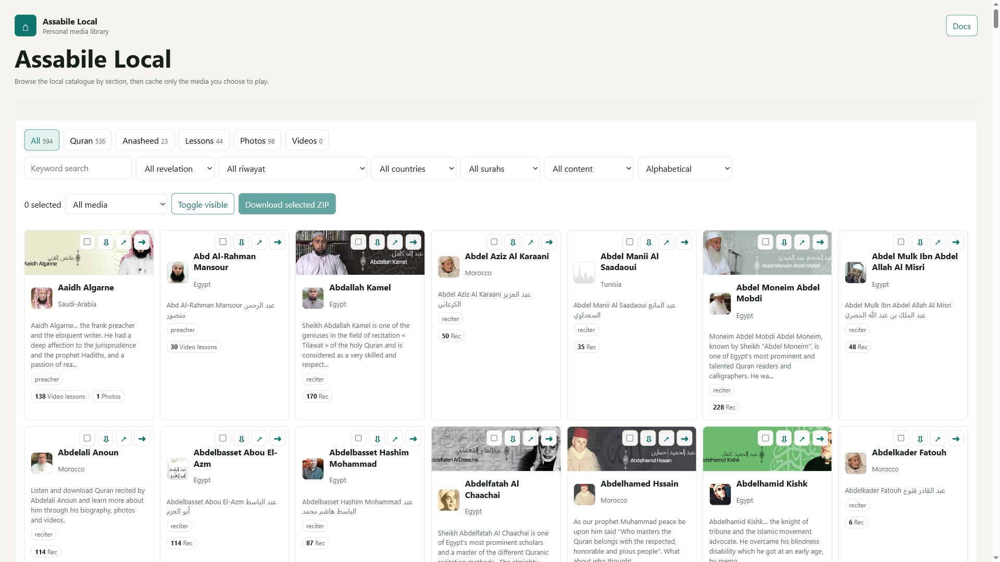

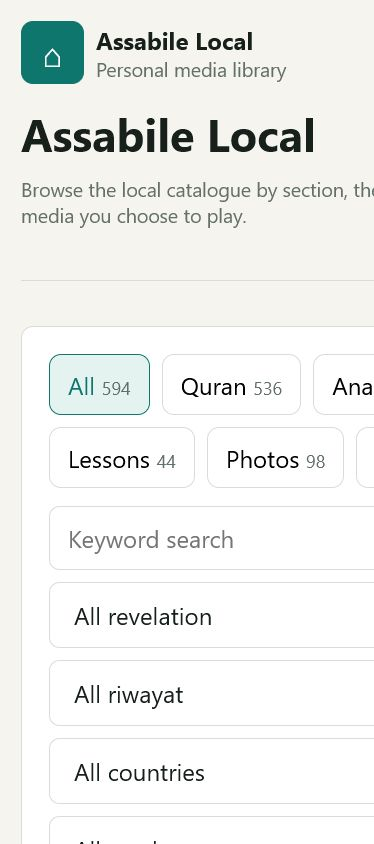

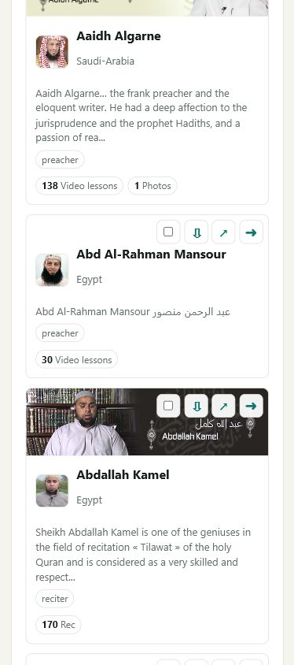

The home page starts with the full local catalogue, section filters, keyword search, country, surah, riwaya, revelation, content, and sort controls.

### Ayman Swed Video Lessons

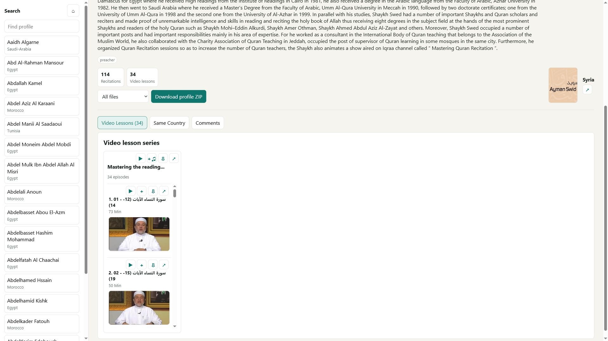

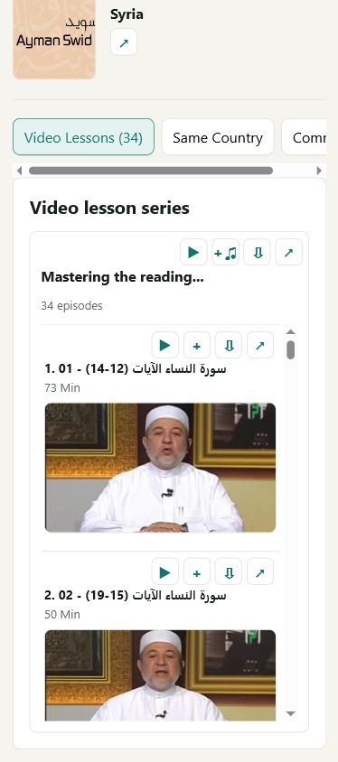

Profiles show Assabile biography text, profile imagery, tab counts, comments access, same-country browsing, and native album-style rendering for lessons and recordings.

### Sudais Collections

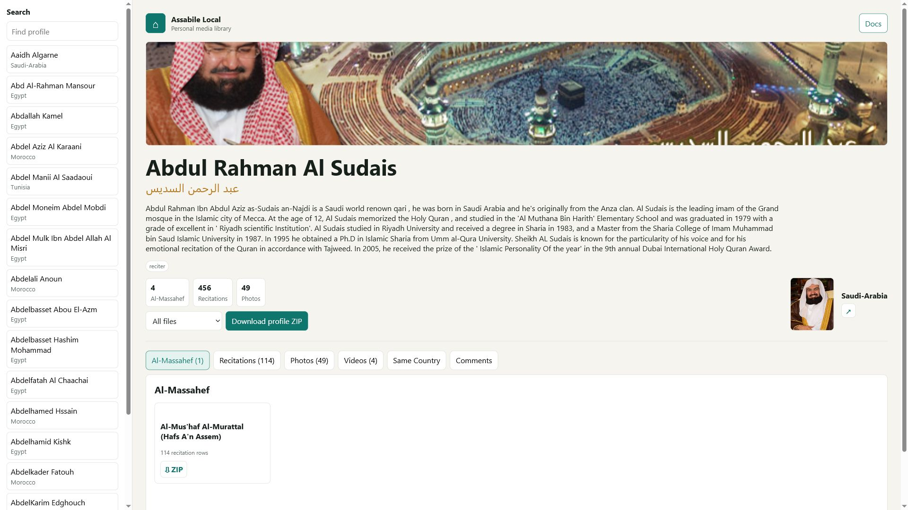

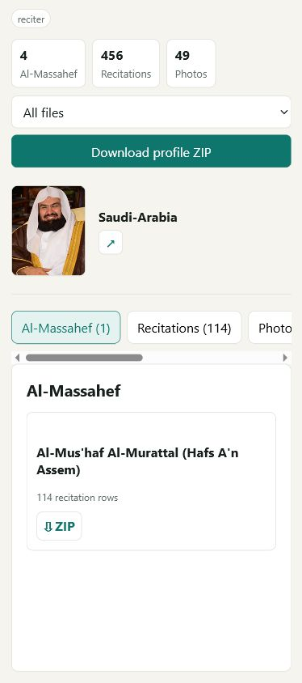

Al-Massahef cards link into collection playback/downloads. Empty collections are visibly disabled while populated collections expose ZIP download actions.

### Sudais Recitation List

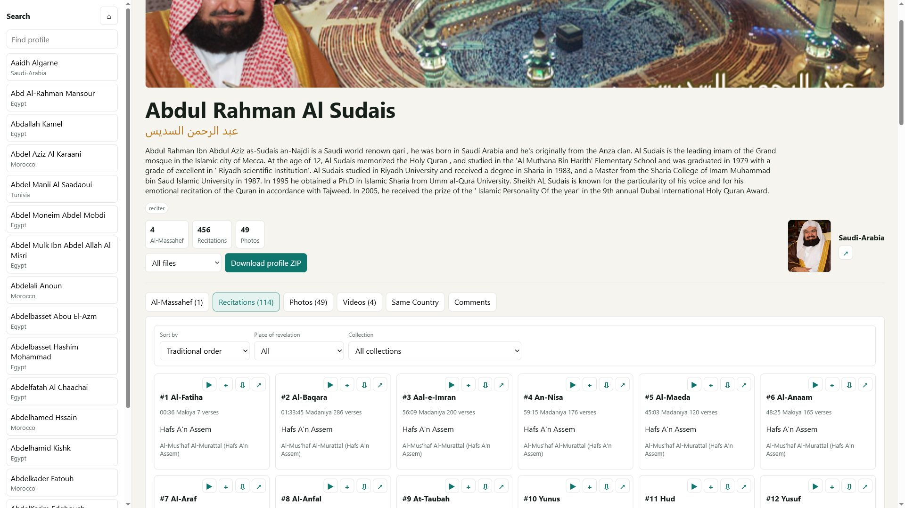

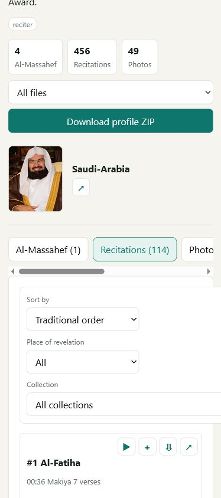

Recitation rows include play, add-to-queue, cache/download, source open, sorting, filters, and the active-track highlight when something is playing.

### Universal Player

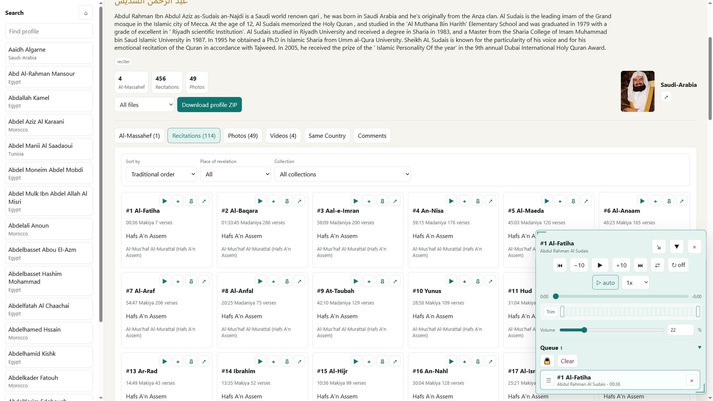

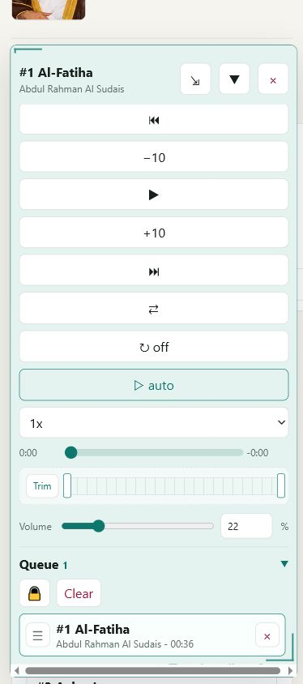

The corner player is shared by recitations, anasheed, lessons, and videos. It includes custom playback controls, seek/trim controls, persistent volume, speed, shuffle, repeat, autoplay, queue count, lock, clear, drag reorder, and per-track delete.

### Controls Documentation

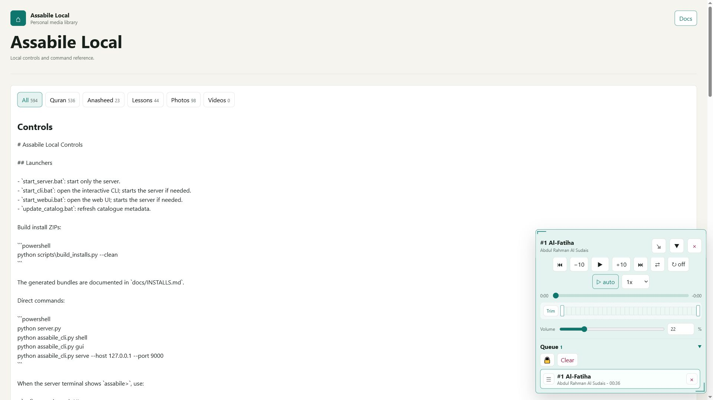

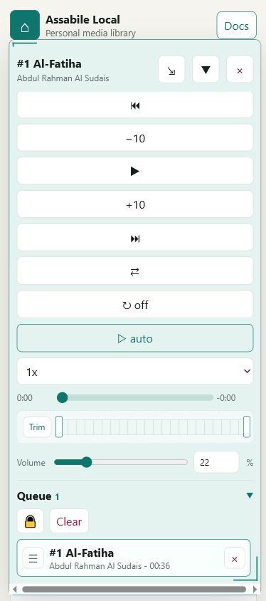

The in-app docs page explains the WebUI controls, CLI commands, downloads, cache behavior, server controls, and catalogue sync flow.

### CLI Examples

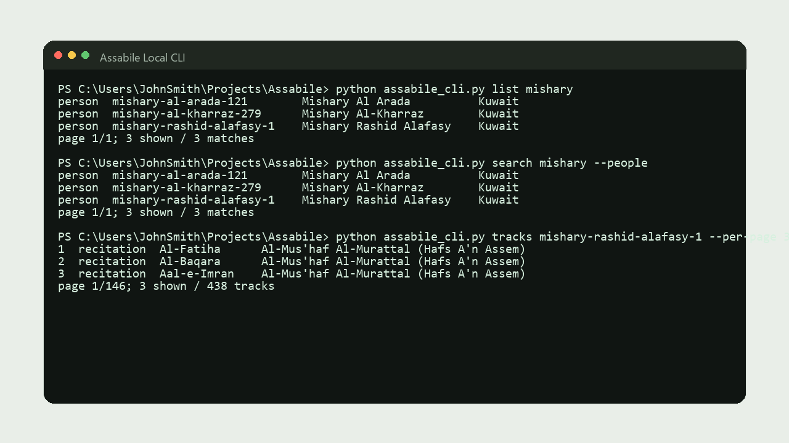

The CLI can search people and tracks, page through profile media, filter by kind, collection, riwaya, surah, revelation, and drive playback/download/cache workflows. CLI screenshots use placeholder paths such as `C:\Users\JohnSmith\Projects\Assabile`.

## Start

One-click Windows launchers:

- `start_server.bat`: starts only the local server.
- `start_cli.bat`: opens the interactive CLI and starts the server if needed.
- `start_webui.bat`: starts the server if needed and opens the web UI.
- `update_catalog.bat`: refreshes the metadata catalogue.

Build separate install ZIPs:

```powershell
python scripts\build_installs.py --clean
```

This creates CLI-only, WebUI-only, and full install bundles under `dist/`. See `docs/INSTALLS.md`.

Direct commands:

```powershell
python server.py
python assabile_cli.py shell
python assabile_cli.py gui
```

The default web UI is:

```text
http://127.0.0.1:8765
```

When `server.py` is running in a terminal, type `gui`, `cli`, `help`, or `stop` at the `assabile>` prompt.

## Sync Metadata

Refresh the public Assabile catalogue metadata without downloading media bytes:

```powershell
python scripts\sync_catalog.py
```

Quick test run:

```powershell
python scripts\sync_catalog.py --max-profiles 5
```

Force a fresh fetch instead of using cached Assabile pages:

```powershell
python scripts\sync_catalog.py --refresh
```

The sync writes `data/catalog.json` and cached HTML/JSON metadata under `data/cache/`. It uses Assabile language fallbacks (`www`, `ar`, `fr`, `es`) for listing discovery, profile pages, media sections, AJAX recitation rows, and video lesson series where possible.

Downloaded media is reused across the CLI and WebUI. If a later catalogue refresh points the same local media item at a different Assabile source URL, the next play/download refreshes the local cached file automatically. If the local file was removed, it is downloaded again on demand.

## CLI

Common commands:

```powershell
python assabile_cli.py list mishary
python assabile_cli.py search ayman --people
python assabile_cli.py profile ayman-swed-345
python assabile_cli.py profile ayman-swed-345 --json
python assabile_cli.py tracks ayman-swed-345 --kind videoLesson --page 2 --per-page 5
python assabile_cli.py tracks abdallah-kamel-318 --kind recitation --riwaya hafs --surah Fatiha
python assabile_cli.py play ayman-swed-345 --index 1
python assabile_cli.py download --person abdallah-kamel-318 --kind recitations
python assabile_cli.py library
python assabile_cli.py cache info
python assabile_cli.py cache clear
```

Track filters work on `search`, `tracks`, and `play`:

- `--kind`: `recitation`, `anasheed`, `audioLesson`, `videoLesson`, or `video`.
- `--surah`
- `--riwaya` / `--riwayah`
- `--collection`
- `--album`
- `--revelation`

Pagination flags `--page` and `--per-page` work on `search` and `tracks`.

Server management:

```powershell
python assabile_cli.py servers list
python assabile_cli.py servers stop --all
python assabile_cli.py serve --host 127.0.0.1 --port 9000
```

## Web UI

The web UI includes:

- Home catalogue with category, country, content, sort, keyword, surah, riwaya, and revelation filters.
- Profile pages with banners, profile images, biography text, same-country links, comments, media tabs, and content counts.
- Al-Massahef collection browsing with disabled empty collections.
- Recitation sorting and filters.
- Anasheed, audio lesson, and video lesson album views.
- Photo and video browsing with on-demand caching.
- Bulk ZIP downloads for selected profiles, profile media kinds, collections, albums, and media sections.
- Universal corner player for audio and video.

## Player

The custom player supports:

- Play/pause, previous/next, skip back/forward 10 seconds.
- Seek bar with elapsed time on the left and remaining time on the right.
- Queue with count, drag reorder, row delete, clear, and lock/unlock.
- Shuffle, repeat off/1/2/3, autoplay, persistent volume, typed volume percentage, and playback speed.
- Temporary trim start/end by handles or exact time entry.
- Resizable corner window, collapse/restore, and fullsize video mode that restores the previous player size.

## Local Media Cache

`data/downloads/` is the permanent local media cache. The server keeps a small `_media_cache.json` index that records which source URL produced each cached file.

- If the file exists and the source URL is unchanged, playback/download reuses the existing local file.
- If the file exists but the source URL changed after catalogue sync, the local file is refreshed.
- If the file was removed, the next play/download fetches it again.
- Bulk downloads and playback share the same cache by source URL. For example, if you download all recitations for a reciter and then play one of those recitations later, the CLI/WebUI reuses the downloaded file while it still exists.
- `python assabile_cli.py cache clear` clears the download cache after confirmation. Use `--yes` only for scripted cleanup.
- Metadata-only sync never bulk-downloads media files.

## Architecture

```text
server.py
|-- serves static UI from public/
|-- exposes JSON APIs under /api/
|-- reads catalogue metadata from data/catalog.json
|-- writes fetched metadata to data/cache/
|-- writes cached/downloaded media to data/downloads/
`-- creates ZIP downloads for bulk requests

assabile_cli.py
|-- starts or controls the local server
|-- searches profiles and tracks
|-- lists and filters profile tracks with pagination
|-- caches and opens selected tracks/videos
`-- runs profile and bulk download workflows

scripts/sync_catalog.py
|-- crawls Assabile metadata pages
|-- merges fallback language sources
|-- extracts profiles, recitations, albums, lessons, photos, videos, bios, banners, comments
`-- updates data/catalog.json

scripts/build_installs.py
|-- builds CLI-only, WebUI-only, and full ZIP installs
`-- excludes generated cache/download folders
```

## Key APIs

- `GET /api/people`: list catalogue profiles.
- `GET /api/person/{id}`: return one profile with tabs and media metadata.
- `GET /api/docs`: return the local controls documentation.
- `POST /api/sync/player`: resolve an Assabile recitation XML into a direct media URL.
- `POST /api/sync/recitations`: fetch an Assabile `/ajax/loadplayer-*` recitation list into cache.
- `POST /api/sync/recordings`: fetch source-page recordings into cache.
- `POST /api/download`: download a direct public media URL into `data/downloads/`.
- `POST /api/bulk-download`: download matching media and return a ZIP.

## License

This project is released under the MIT License. See `LICENSE`.
